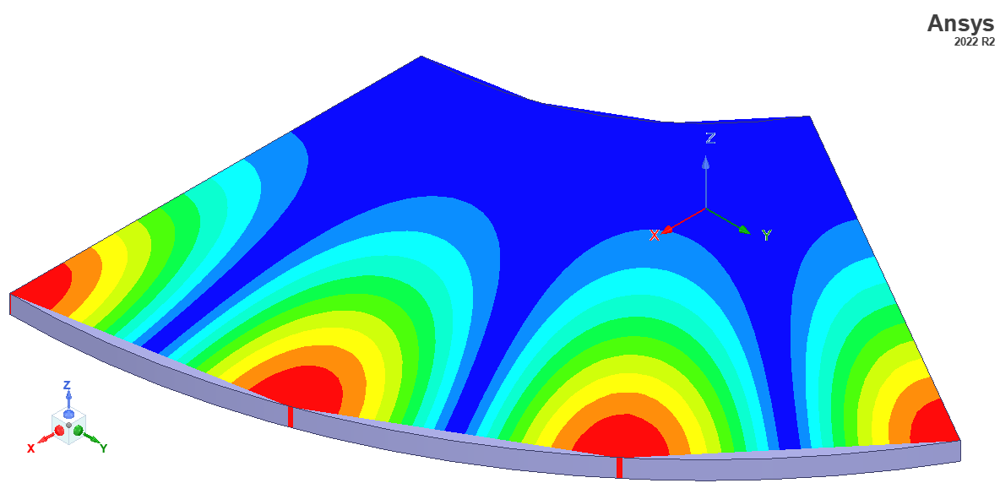
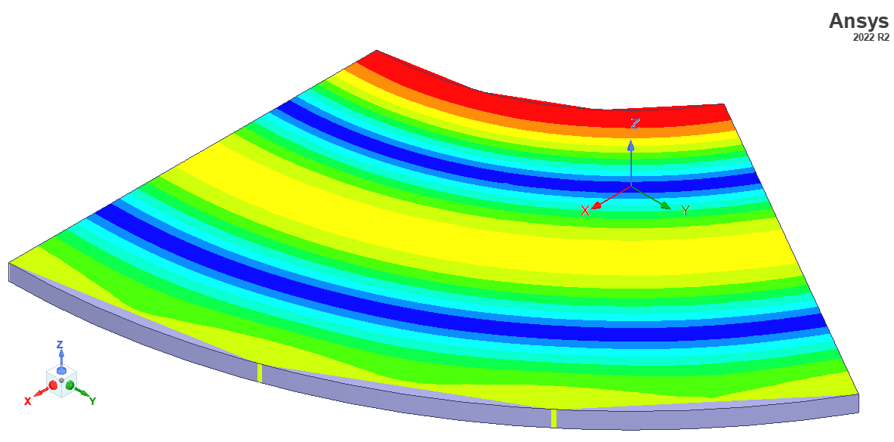

## resonant frequency formula

$$ f_{res} = {c \chi_{vm} \over 2\pi a \sqrt{\epsilon_r} } $$
For and alumina loaded ASR cavity with $a=1$ cm, $b=2.45$ cm and $\phi = {\pi\over3}$, HFSS eigenmode simulation yields $f_{31} = 6.58$ and $f_{02} = 6.7$ GHz. According to formula degenerate resonant frequency is $f_{res} = 6.65$ GHz. 

## multimode plot

## TM31 and TM02 mode
 

